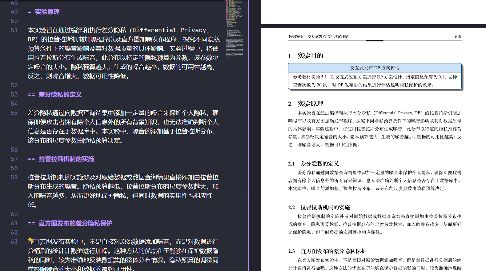
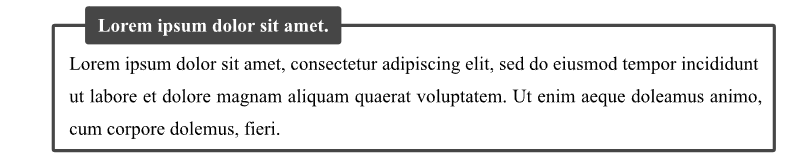
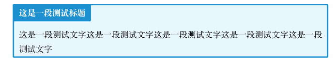

# HNU-Lab-Report-Template-Typst

适用于湖南大学信息科学与工程学院的实验报告 Typst 模版，涵盖封面，目录，标题，代码块，公式等内容。

此模版修改自 NKU 实验报告 Typst 模版：[Starlight0798/typst-nku-lab-template](https://github.com/Starlight0798/typst-nku-lab-template)，在其基础上添加 HNU 校徽和校名，调整封面间距，并复刻 Word 版实验报告封面略为模糊的校徽风格。

当前 Typst 版本：Typst 0.13

## 关于 Typst

Typst 是可用于出版的可编程标记语言，拥有变量、函数与包管理等现代编程语言的特性，注重于科学写作 (science writing)，定位与 LaTeX 相似。

- **语法简洁**：上手难度跟 Markdown 相当，文本源码阅读性高，不会像 LaTeX 一样充斥着反斜杠与花括号。
- **编译速度快**：Typst 使用 Rust 语言编写，即 typ(e+ru)st，目标运行平台是 WASM，即浏览器本地离线运行；也可以编译成命令行工具，采用一种增量编译算法和一种有约束的版面缓存方案，文档长度基本不会影响编译速度，且编译速度与常见 Markdown 渲染引擎渲染速度相当。
- **环境搭建简单**：不需要像 LaTeX 一样折腾几 G 的开发环境，原生支持中日韩等非拉丁语言，无论是官方 Web App 在线编辑，还是使用 VS Code 安装插件本地开发，都是即开即用。
- **现代编程语言**：Typst 是可用于出版的可编程标记语言，拥有变量、函数、包管理与错误检查等现代编程语言的特性，同时也提供了闭包等特性，便于进行函数式编程。以及包括了 [标记模式]、{脚本模式} 与 $数学模式$ 等多种模式的作用域，并且它们可以不限深度地、交互地嵌套。并且通过[包管理](https://typst-doc-cn.github.io/docs/packages/)，你不再需要像 TexLive 一样在本地安装一大堆并不必要的宏包，而是按需自动从云端下载。

[Typst中文文档](https://typst-doc-cn.github.io/docs/chinese/) | [Typst官方文档](https://typst.app/docs/) | [Typst WebApp](https://typst.app/)

## 使用方法

​使用模板方法如下：

1. 创建你的 Typst 文件，比如 `main.typ`。
2. 将仓库的 `img` 文件夹与 `template.typ` 放入 `main.typ` 同目录下
3.  在 `main.typ` 插入如下代码：

```javascript
#import "template.typ": *
#import XXX  // 这里引入你需要使用的其他包(若干)，参照 demo.typ

#show: project.with(
  course: "硅基生命护理",
  lab_name: "硅基生命基础结构实验",
  stu_name: "你的名字",
  stu_num: "114514",
  major: "硅基生物学",
  department: "赛博生物工程学院",
  date: (2077, 1, 1),
  show_content_figure: true,  // 开启目录
  watermark: "HNU",  // 添加每页水印
)
```

4. 编写你自己的代码

另外，实验报告可能需要用到不同样式的表格、图片、流程图、代码块等，详见 `demo.typ`，里面都有使用示例，基本都是调用各个库来完成效果，避免重复造轮子。

## 编写

建议使用 VS Code + Tinymist Typst 插件编写，Tinymmist Typst 插件可以让你编写的过程达到**实时同步**的效果(**编译速度优于 LaTeX**)，Tinymist Typst 插件有诸多使用特性，不多赘述。



## 示例

比如你想要画一个像 `demo.typ` 里面的这样的**丰富内容块**：



那么首先需要在你的 `main.typ` 中顶部引入包，具体是哪个包在 `demo` 中二级标题都有注明：

```js
#import "@preview/colorful-boxes:1.4.2": *
```

然后在你需要放置的部分加入以下代码：

```typescript
#colorbox(title: [这是一段测试标题], color: "blue")[
  这是一段测试文字这是一段测试文字这是一段测试文字这是一段测试文字这是一段测试文字
]
```

> 如果你找不到代码，建议使用 `preview` 功能进行实时预览，这样你直接点击你想要的组件，就会自动跳转到对应的代码(虽然很多时候是跳转到组件库内部…)。

效果如下，当然 `color` 可以自己调：



其余任何组件同理。

**(注：codly 等包在模板文件已经引入，无需再次引入)**
